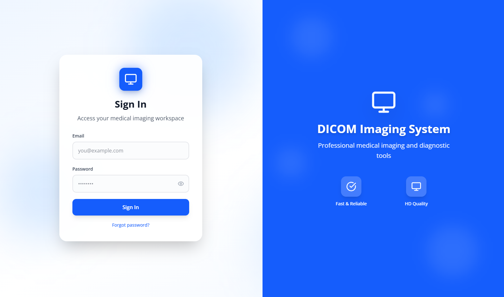
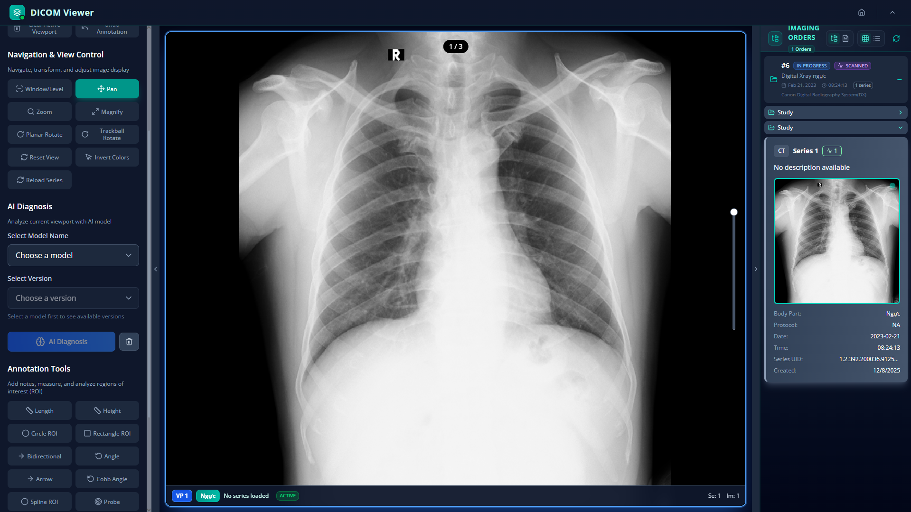

# DICOM Medical Imaging System

A comprehensive Digital Imaging and Communications in Medicine (DICOM) system designed for medical imaging management, radiology workflows, and patient care coordination.

## 📋 Table of Contents

- [Introduction](#introduction)
- [System Overview](#system-overview)
- [Key Features](#key-features)
- [Technology Stack](#technology-stack)
- [System Components](#system-components)
- [User Roles & Access](#user-roles--access)
- [Core Functionality](#core-functionality)
- [API Overview](#api-overview)
- [Deployment](#deployment)
- [Security & Compliance](#security--compliance)

## 🎯 Introduction

The DICOM Medical Imaging System is a modern, web-based platform that provides comprehensive solutions for managing medical imaging workflows. Built with a microservices architecture, the system enables healthcare facilities to efficiently handle DICOM studies, patient records, diagnostic reports, and radiology workflows.

The system is designed to support various healthcare professionals including radiologists, administrators, imaging technicians, and reception staff, each with role-specific interfaces and capabilities.

### Login Interface

*Secure authentication interface for system access*

### DICOM Viewer

*Advanced web-based DICOM image viewer with multi-planar reconstruction capabilities*

## 🏥 System Overview

This system provides a complete end-to-end solution for medical imaging management:

- **DICOM Image Viewing**: Advanced web-based DICOM viewer with multi-planar reconstruction, window/level adjustments, and measurement tools
- **Patient Management**: Comprehensive patient records, medical history, and encounter tracking
- **Radiology Workflow**: Streamlined workflow for radiologists to manage studies, create reports, and track diagnoses
- **Imaging Orders**: Management of imaging orders, modality scheduling, and procedure tracking
- **Report Management**: Template-based diagnostic report creation with digital signatures
- **User & Access Management**: Role-based access control with department and room assignments
- **Real-time Communication**: WebSocket-based notifications and real-time updates
- **AI Integration**: AI-powered analysis capabilities for medical imaging

## ✨ Key Features

### 1. DICOM Image Viewer

*Advanced DICOM viewer with comprehensive imaging tools*

- **Multi-planar Reconstruction (MPR)**: View images in axial, coronal, and sagittal planes
- **Window/Level Adjustment**: Optimize image contrast and brightness
- **Measurement Tools**: Distance, angle, and ROI measurements
- **Annotations**: Add text, arrows, and shapes to images
- **Series Navigation**: Easy navigation between series and studies
- **Image Manipulation**: Zoom, pan, rotate, and flip operations
- **Cornerstone.js Integration**: Industry-standard DICOM viewing library

### 2. Patient Management

- **Patient Registration**: Complete patient demographics and medical history
- **Encounter Tracking**: Track patient visits and encounters
- **Medical Records**: Comprehensive medical record management
- **Diagnosis History**: Track diagnoses and treatment plans
- **Report Templates**: Customizable diagnostic report templates

### 3. Radiology Workflow

- **Study Assignment**: Assign DICOM studies to radiologists
- **Work Queue**: Manage pending and completed studies
- **Report Creation**: Create diagnostic reports with templates
- **Digital Signatures**: Secure digital signature for reports
- **Report Templates**: Standard and custom report templates
- **Multi-tab Interface**: Work with multiple patients simultaneously

### 4. Imaging Management

- **DICOM Studies**: Upload, store, and manage DICOM studies
- **Series Management**: Organize DICOM series and instances
- **Imaging Orders**: Create and track imaging orders
- **Modality Integration**: Support for various imaging modalities (CT, MRI, X-Ray, etc.)
- **Body Part Classification**: Organize studies by anatomical regions
- **Storage Management**: Efficient DICOM file storage and retrieval

### 5. User & Access Management

- **Role-Based Access Control (RBAC)**: Granular permission system
- **Department Management**: Organize users by departments
- **Room Assignments**: Assign staff to specific rooms
- **Shift Templates**: Manage work schedules and shifts
- **User Profiles**: Comprehensive user profile management

### 6. System Administration

- **System Configuration**: Centralized system settings
- **Notifications**: Real-time notification system
- **Analytics**: System usage and performance analytics
- **Audit Logs**: Track system activities and changes
- **AI Analysis**: Integration with AI analysis services

## 🛠️ Technology Stack

### Backend

- **Framework**: NestJS (Node.js, TypeScript)
- **Database**: PostgreSQL with TypeORM
- **Caching**: Redis
- **Communication**: NestJS Microservices (TCP), Socket.IO (WebSockets)
- **Authentication**: JWT (JSON Web Tokens)
- **API Documentation**: Swagger/OpenAPI
- **Architecture**: Microservices with Nx Monorepo

### Frontend

- **Framework**: Next.js 15 with React 18
- **State Management**: Redux Toolkit
- **UI Framework**: Radix UI components with Tailwind CSS
- **DICOM Viewer**: Cornerstone.js
- **Forms**: React Hook Form with Zod validation
- **Real-time**: Socket.IO Client
- **Charts**: Recharts for data visualization

## 🔧 System Components

### Backend Services

| Service | Port | Description |
|---------|------|-------------|
| **API Gateway** | 5000 | Main entry point, routes requests, aggregates responses |
| **User Service** | 5002 | User authentication, authorization, user management |
| **Patient Service** | 5004 | Patient records, encounters, medical history |
| **Imaging Service** | 5003 | DICOM studies, series, instances, imaging orders |
| **System Service** | 5005 | System configuration, notifications, AI analysis |
| **WebSocket Gateway** | 5006 | Real-time communication and notifications |

### Frontend Applications

- **Web Application**: Main Next.js application accessible via web browser
- **Admin Dashboard**: Administrative interface for system management
- **Radiologist Interface**: Specialized workflow interface for radiologists
- **Reception Interface**: Patient registration and appointment management

## 👥 User Roles & Access

The system supports multiple user roles with specific permissions:

### Administrator
- Full system access
- User and role management
- System configuration
- Analytics and reporting

### Radiologist
- DICOM study viewing and analysis
- Diagnostic report creation and editing
- Patient record access
- Work queue management

### Imaging Technician
- DICOM study upload and management
- Modality machine configuration
- Study quality control

### Reception Staff
- Patient registration
- Appointment scheduling
- Basic patient information access

### Department Head
- Department-specific management
- Staff assignment and scheduling
- Department analytics

## 📊 Core Functionality

### DICOM Workflow

1. **Study Upload**: Imaging technicians upload DICOM studies
2. **Study Assignment**: Studies are assigned to radiologists
3. **Image Review**: Radiologists review images using the DICOM viewer
4. **Report Creation**: Diagnostic reports are created using templates
5. **Report Review**: Reports are reviewed and digitally signed
6. **Report Distribution**: Reports are distributed to referring physicians

### Patient Workflow

1. **Registration**: Patients are registered in the system
2. **Imaging Order**: Imaging orders are created by physicians
3. **Study Acquisition**: Studies are acquired and uploaded
4. **Diagnosis**: Radiologists create diagnostic reports
5. **Report Delivery**: Reports are delivered to referring physicians
6. **Follow-up**: Patient follow-up and history tracking

### Report Template System

- **Standard Templates**: Pre-defined templates for common procedures
- **Custom Templates**: User-created templates for specific needs
- **Template Sharing**: Public templates available to all users
- **Template Categories**: Organized by modality and body part

## 🔌 API Overview

The system provides RESTful APIs through the API Gateway:

### Authentication
- User login and authentication
- JWT token management
- Role-based authorization

### Patient Management
- Patient CRUD operations
- Encounter management
- Medical history tracking

### Imaging
- DICOM study management
- Series and instance operations
- Imaging order management

### Reports
- Report creation and editing
- Template management
- Digital signature processing

### System
- User management
- Department and room management
- System configuration

**API Documentation**: Available via Swagger UI at `/api` endpoint when services are running.

## 🚀 Deployment

The system is designed for containerized deployment:

### Docker Deployment
- All services include Dockerfiles
- Docker Compose configuration for local development
- Production-ready container images

### Cloud Deployment
- Fly.io configuration files included
- Scalable microservices architecture
- Load balancing and service discovery ready

### Infrastructure Requirements
- PostgreSQL database
- Redis cache
- Network connectivity between services
- Sufficient storage for DICOM files

## 🔒 Security & Compliance

### Security Features

- **Authentication**: JWT-based authentication
- **Authorization**: Role-based access control (RBAC)
- **Data Encryption**: Encrypted data transmission (HTTPS/WSS)
- **Digital Signatures**: Secure report signing
- **Audit Logging**: Comprehensive activity logging

### Compliance Considerations

- **HIPAA**: Healthcare data privacy and security
- **GDPR**: Data protection and privacy
- **DICOM Standards**: Compliance with DICOM protocols
- **Medical Device Regulations**: As applicable in deployment region

**Important**: Ensure proper security configuration and compliance measures are in place before deploying in production healthcare environments.

## 📈 System Capabilities

- **Scalability**: Microservices architecture allows independent scaling
- **Reliability**: Service isolation prevents cascading failures
- **Maintainability**: Modular design with shared libraries
- **Extensibility**: Easy to add new services and features
- **Performance**: Optimized for medical imaging workflows
- **Integration**: Ready for integration with PACS, HIS, and RIS systems

## 🌟 Use Cases

- **Hospital Radiology Departments**: Complete radiology workflow management
- **Imaging Centers**: DICOM study management and reporting
- **Telemedicine**: Remote image viewing and consultation
- **Medical Education**: Training and educational purposes
- **Research**: Medical imaging research and analysis

## 📞 Support & Documentation

- **API Documentation**: Swagger UI available at service endpoints
- **Service Documentation**: Individual service READMEs
- **Code Documentation**: Inline code documentation

---

**Note**: This system is designed for medical imaging management. Proper security, compliance, and regulatory measures must be implemented before production deployment in healthcare environments.
