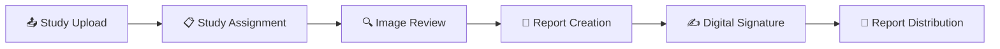
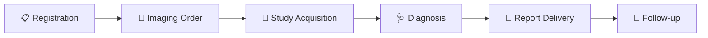

<p align="center">
  
</p>

<h1 align="center">DICOM Medical Imaging System</h1>

<p align="center">
  <strong>A comprehensive Digital Imaging and Communications in Medicine (DICOM) platform for medical imaging management, radiology workflows, and patient care coordination.</strong>
</p>

<p align="center">
  <a href="#-quick-start">Quick Start</a> •
  <a href="#-key-features">Features</a> •
  <a href="#-architecture">Architecture</a> •
  <a href="#-documentation">Docs</a> •
  <a href="#-deployment">Deploy</a>
</p>

<p align="center">
  
  
  
  
  
  
</p>

---

## 📸 Screenshots

<table>
  <tr>
    <td width="50%">
      
      <p align="center"><em>Secure Authentication</em></p>
    </td>
    <td width="50%">
      
      <p align="center"><em>Advanced DICOM Viewer</em></p>
    </td>
  </tr>
</table>

---

## 🚀 Quick Start

### Prerequisites

| Requirement | Version |
|-------------|---------|
| Node.js | 18+ |
| PostgreSQL | 14+ |
| Redis | 6+ |
| npm | 9+ |

### Installation & Setup

```bash
# 1. Clone the repository
git clone <repository-url>
cd DICOM

# 2. Start Backend Services
cd apps/backend
npm install
cp .env.example .env          # Configure environment variables
npm run dev                    # Starts all microservices

# 3. Start Frontend (new terminal)
cd apps/frontend
npm install
cp .env.example .env          # Configure environment variables
npm run dev                    # Starts Next.js dev server
```

### Access Points

| Application | URL | Description |
|-------------|-----|-------------|
| 🌐 **Frontend** | [localhost:3000](http://localhost:3000) | Web application |
| 🔌 **API Gateway** | [localhost:5000](http://localhost:5000) | REST API endpoint |
| 📖 **API Docs** | [localhost:5000/api](http://localhost:5000/api) | Swagger documentation |
| 🔄 **WebSocket** | [localhost:5006](http://localhost:5006) | Real-time notifications |

> 📚 **Detailed Documentation**
> - [Frontend Setup Guide](apps/frontend/README.md)
> - [Backend Setup Guide](apps/backend/README.md)

---

## ✨ Key Features

### 🖼️ DICOM Image Viewer
Advanced web-based medical image viewer powered by **Cornerstone.js**

| Feature | Description |
|---------|-------------|
| **Multi-planar Reconstruction** | View in axial, coronal, and sagittal planes |
| **Window/Level Controls** | Optimize contrast and brightness |
| **Measurement Tools** | Distance, angle, and ROI measurements |
| **Annotations** | Add text, arrows, and shapes |
| **Series Navigation** | Easy navigation between series and studies |
| **Image Manipulation** | Zoom, pan, rotate, and flip operations |

### 👥 Role-Based Dashboards

```
┌─────────────────┐   ┌─────────────────┐   ┌─────────────────┐
│   👔 Admin      │   │  🩺 Radiologist │   │  👨‍💼 Reception   │
├─────────────────┤   ├─────────────────┤   ├─────────────────┤
│ • User Mgmt     │   │ • Study Review  │   │ • Patient Reg   │
│ • System Config │   │ • Report Create │   │ • Scheduling    │
│ • Analytics     │   │ • Work Queue    │   │ • Appointments  │
│ • Departments   │   │ • Templates     │   │ • Orders        │
└─────────────────┘   └─────────────────┘   └─────────────────┘

┌─────────────────┐   ┌─────────────────┐
│ 🔬 Technician   │   │  👨‍⚕️ Physician   │
├─────────────────┤   ├─────────────────┤
│ • Study Upload  │   │ • Order Create  │
│ • Quality Ctrl  │   │ • Report View   │
│ • Modality Ops  │   │ • Patient Hist  │
└─────────────────┘   └─────────────────┘
```

### 📋 Patient Management
- Complete demographics and medical history
- Encounter tracking and visit management
- Diagnosis history and treatment plans

### 📝 Radiology Workflow
- Study assignment and work queue management
- Template-based diagnostic report creation
- Digital signature for report verification
- Multi-tab interface for simultaneous patient work

### 🔔 Real-time Notifications
- WebSocket-based live updates
- Cross-role communication
- System alerts and status updates

---

## 🏗️ Architecture

### System Overview

```
                                    ┌─────────────────────────────────┐
                                    │         Frontend (Next.js)      │
                                    │      http://localhost:3000      │
                                    └────────────────┬────────────────┘
                                                     │
                                                     ▼
┌────────────────────────────────────────────────────────────────────────────┐
│                          API Gateway (Port 5000)                            │
│                    Authentication • Routing • Aggregation                   │
└─────────┬──────────────────┬──────────────────┬──────────────────┬─────────┘
          │                  │                  │                  │
          ▼                  ▼                  ▼                  ▼
┌─────────────────┐ ┌─────────────────┐ ┌─────────────────┐ ┌─────────────────┐
│  User Service   │ │ Patient Service │ │ Imaging Service │ │ System Service  │
│   Port 5002     │ │   Port 5004     │ │   Port 5003     │ │   Port 5005     │
├─────────────────┤ ├─────────────────┤ ├─────────────────┤ ├─────────────────┤
│ • Authentication│ │ • Patients      │ │ • DICOM Studies │ │ • Configuration │
│ • Users & Roles │ │ • Encounters    │ │ • Series/Inst.  │ │ • Notifications │
│ • Departments   │ │ • Medical Hist  │ │ • Imaging Orders│ │ • AI Analysis   │
│ • Permissions   │ │ • Diagnoses     │ │ • Reports       │ │ • Audit Logs    │
└────────┬────────┘ └────────┬────────┘ └────────┬────────┘ └────────┬────────┘
         │                   │                   │                   │
         └───────────────────┴───────────────────┴───────────────────┘
                                         │
                    ┌────────────────────┼────────────────────┐
                    ▼                    ▼                    ▼
           ┌─────────────────┐  ┌─────────────────┐  ┌─────────────────┐
           │   PostgreSQL    │  │      Redis      │  │   Cloudinary    │
           │    Database     │  │      Cache      │  │  File Storage   │
           └─────────────────┘  └─────────────────┘  └─────────────────┘

                    ┌─────────────────────────────────────────┐
                    │        WebSocket Gateway (Port 5006)     │
                    │         Real-time Communication          │
                    └─────────────────────────────────────────┘
```

### Backend Services

| Service | Port | Responsibilities |
|---------|------|------------------|
| **API Gateway** | 5000 | Request routing, JWT validation, response aggregation |
| **User Service** | 5002 | Authentication, authorization, user/role/department management |
| **Imaging Service** | 5003 | DICOM studies, series, instances, imaging orders, reports |
| **Patient Service** | 5004 | Patient records, encounters, medical history, diagnoses |
| **System Service** | 5005 | System configuration, notifications, AI analysis, audit logs |
| **WebSocket Gateway** | 5006 | Real-time communication, live notifications, event broadcasting |

### Technology Stack

<table>
<tr>
<td width="50%" valign="top">

#### 🔧 Backend
| Tech | Purpose |
|------|---------|
| NestJS 11 | Framework |
| TypeScript 5.8 | Language |
| PostgreSQL | Database |
| TypeORM | ORM |
| Redis | Caching |
| Socket.IO | WebSockets |
| JWT | Authentication |
| Swagger | API Docs |
| Nx | Monorepo |

</td>
<td width="50%" valign="top">

#### 🎨 Frontend
| Tech | Purpose |
|------|---------|
| Next.js 15 | Framework |
| React 18 | UI Library |
| Redux Toolkit | State Mgmt |
| Tailwind CSS 4 | Styling |
| Radix UI | Components |
| Cornerstone.js | DICOM Viewer |
| React Hook Form | Forms |
| Zod | Validation |
| Socket.IO | Real-time |

</td>
</tr>
</table>

---

## 📁 Project Structure

```
DICOM/
├── 📁 apps/
│   ├── 📁 frontend/                 # Next.js web application
│   │   ├── src/
│   │   │   ├── app/                 # App Router pages
│   │   │   ├── components/          # React components
│   │   │   ├── store/               # Redux state management
│   │   │   └── ...
│   │   └── README.md
│   │
│   └── 📁 backend/                  # NestJS microservices
│       ├── apps/
│       │   ├── api-gateway/         # API Gateway service
│       │   ├── user-service/        # User management service
│       │   ├── patient-service/     # Patient management service
│       │   ├── imaging-service/     # DICOM imaging service
│       │   ├── system-service/      # System configuration service
│       │   └── ws-gateway/          # WebSocket service
│       ├── libs/                    # Shared libraries
│       │   ├── database/            # Database configuration
│       │   ├── redis/               # Redis client
│       │   ├── shared-domain/       # Entities and DTOs
│       │   └── ...
│       └── README.md
│
├── 📁 docs/                         # Documentation & images
└── 📄 README.md                     # This file
```

---

## 📊 Core Workflows

### DICOM Study Workflow



### Patient Workflow



---

## 🐳 Deployment

### Docker Compose (Recommended)

```bash
cd apps/backend

# Build and start all services
npm run docker:up:local:build

# View logs
npm run docker:logs

# Stop services
npm run docker:down
```

### Docker Commands

| Command | Description |
|---------|-------------|
| `docker:build:local` | Build all images with local tag |
| `docker:up:local` | Start all containers |
| `docker:up:local:build` | Build and start containers |
| `docker:down` | Stop all containers |
| `docker:logs` | View all container logs |
| `docker:ps` | List running containers |

### Infrastructure Requirements

| Component | Requirement |
|-----------|-------------|
| PostgreSQL | Database for persistent storage |
| Redis | Session cache and pub/sub |
| Storage | Sufficient space for DICOM files |
| Network | Connectivity between services |

---

## 🔒 Security & Compliance

### Security Features

| Feature | Implementation |
|---------|----------------|
| **Authentication** | JWT-based token authentication |
| **Authorization** | Role-based access control (RBAC) |
| **Encryption** | HTTPS/WSS encrypted transmission |
| **Digital Signatures** | Secure report signing |
| **Audit Logging** | Comprehensive activity tracking |

### Compliance Considerations

| Standard | Description |
|----------|-------------|
| **HIPAA** | Healthcare data privacy and security |
| **GDPR** | Data protection and privacy |
| **DICOM** | Standards compliance |
| **IHE** | Integration profiles |

> ⚠️ **Important**: Ensure proper security configuration and compliance measures are in place before deploying in production healthcare environments.

---

## 🌟 Use Cases

- 🏥 **Hospital Radiology Departments** - Complete radiology workflow management
- 🏢 **Imaging Centers** - DICOM study management and reporting
- 💻 **Telemedicine** - Remote image viewing and consultation
- 📚 **Medical Education** - Training and educational purposes
- 🔬 **Research** - Medical imaging research and analysis

---

## 📚 Documentation

| Resource | Description |
|----------|-------------|
| [Frontend README](apps/frontend/README.md) | Frontend setup and development |
| [Backend README](apps/backend/README.md) | Backend services and configuration |
| [API Documentation](http://localhost:5000/api) | Swagger API reference |

---

## 📈 System Capabilities

| Capability | Description |
|------------|-------------|
| **Scalability** | Microservices allow independent scaling |
| **Reliability** | Service isolation prevents cascading failures |
| **Maintainability** | Modular design with shared libraries |
| **Extensibility** | Easy to add new services and features |
| **Performance** | Optimized for medical imaging workflows |
| **Integration** | Ready for PACS, HIS, and RIS integration |

---

<p align="center">
  <strong>Built for Healthcare. Designed for Excellence.</strong>
</p>

<p align="center">
  <sub>⚕️ This system is designed for medical imaging management. Proper security, compliance, and regulatory measures must be implemented before production deployment in healthcare environments.</sub>
</p>
