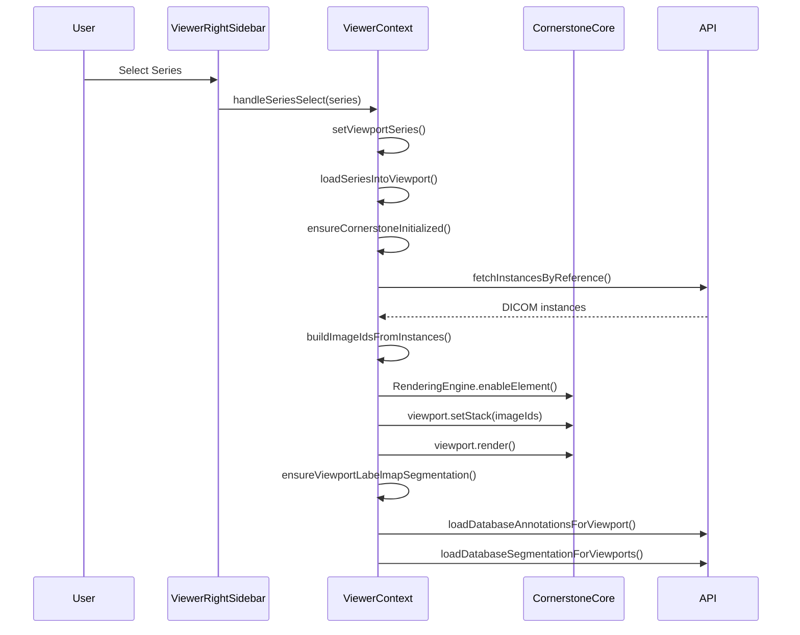
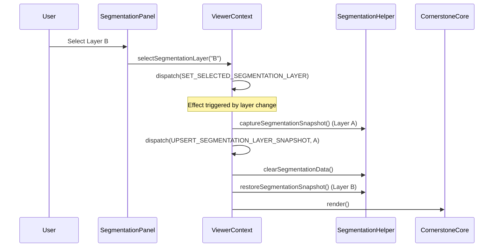
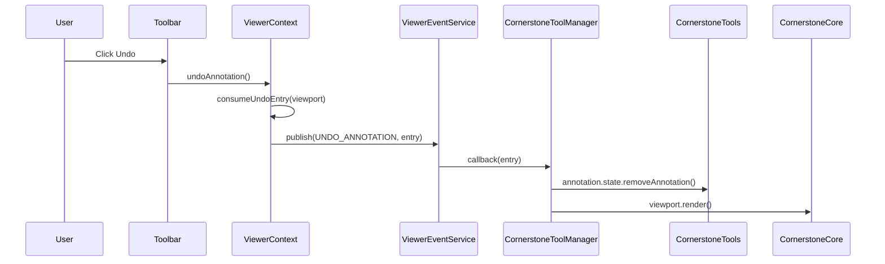

# DICOM Viewer System - Comprehensive Technical Documentation

This document provides an exhaustive technical reference for the DICOM Viewer system, covering architecture, initialization, state management, and all component interactions.

---

## Table of Contents

1. [Architecture Overview](#1-architecture-overview)
2. [Provider Hierarchy & Initialization](#2-provider-hierarchy--initialization)
3. [ViewerContext - Core State Management](#3-viewercontext---core-state-management)
4. [ViewerEventContext - Event System](#4-viewereventcontext---event-system)
5. [Viewer Reducer - State Actions](#5-viewer-reducer---state-actions)
6. [Viewport Management](#6-viewport-management)
7. [Cornerstone.js Integration](#7-cornerstonejs-integration)
8. [Annotation Management](#8-annotation-management)
9. [Segmentation Management](#9-segmentation-management)
10. [Utility Functions](#10-utility-functions)
11. [Component Structure](#11-component-structure)
12. [Data Flow Diagrams](#12-data-flow-diagrams)

---

## 1. Architecture Overview

The DICOM Viewer is built using a layered architecture with React Context for state management and Cornerstone.js for medical image rendering.

### Core Dependencies

| Library | Purpose |
|---------|---------|
| `@cornerstonejs/core` | Core rendering engine, viewport management, image loading |
| `@cornerstonejs/tools` | Annotation tools, segmentation tools, measurement tools |
| `@cornerstonejs/dicom-image-loader` | DICOM file parsing and decoding |
| `pako` | Compression/decompression for segmentation snapshots |
| `uuid` | Unique ID generation for layers and annotations |

### High-Level Component Hierarchy

```
ViewerPageClient
├── ViewerEventProvider          ← Event pub/sub system
│   └── ViewerProvider           ← Core state management
│       ├── ViewerHeader         ← Toolbar with tool selection
│       ├── ViewerLeftSidebar    ← Tool panels, annotation controls
│       ├── ViewportGrid         ← Main viewport container
│       │   └── ViewPortMain     ← Individual viewport components
│       └── ViewerRightSidebar   ← Series browser, study info
```

---

## 2. Provider Hierarchy & Initialization

### 2.1 Entry Point: `ViewerPageClient.tsx`

**File:** `apps/frontend/src/app/viewer/ViewerPageClient.tsx`

The main entry component wraps the viewer in two context providers:

```tsx
export default function ViewerPageClient() {
  return (
    <ViewerEventProvider>           {/* Event system - outermost */}
      <ViewerProvider>              {/* State management */}
        <Suspense fallback={<ViewerLoading />}>
          <ViewerPageContent />
        </Suspense>
      </ViewerProvider>
    </ViewerEventProvider>
  );
}
```

**Key Logic:**
- URL parameters `?study=` and `?patient=` control which study/patient to load
- Initial viewport is set to `0` on mount
- Study status determines if annotations/segmentations are locked (for finalized studies)

### 2.2 Provider Order Importance

1. **ViewerEventProvider** (outer) - Provides event pub/sub service
2. **ViewerProvider** (inner) - Provides viewer state and actions

This order ensures events are available before state management initializes.

---

## 3. ViewerContext - Core State Management

**File:** `apps/frontend/src/common/contexts/ViewerContext.tsx`

### 3.1 Context Type Definition

```typescript
interface ViewerContextType {
  state: ViewerState;
  
  // Tool Actions
  setActiveTool: (tool: ToolType) => void;
  setLayout: (layout: GridLayout) => void;
  setActiveViewport: (viewport: number) => void;
  resetView: () => void;
  rotateViewport: (degrees: number) => void;
  invertViewport: () => void;
  getViewportTransform: (viewport: number) => ViewportTransform;
  
  // Viewport Actions
  setViewportSeries: (viewport: number, series: DicomSeries) => void;
  getViewportSeries: (viewport: number) => DicomSeries | undefined;
  setViewportId: (viewport: number, viewportId: string) => void;
  getViewportId: (viewport: number) => string | undefined;
  setRenderingEngineId: (viewport: number, id: string) => void;
  getRenderingEngineId: (viewport: number) => string | undefined;
  registerViewportElement: (viewport: number, element: HTMLDivElement | null) => void;
  disposeViewport: (viewport: number) => void;
  loadSeriesIntoViewport: (viewport: number, series?, options?) => Promise<void>;
  getViewportState: (viewport: number) => ViewportRuntimeState;
  getStackViewport: (viewport: number) => Types.IStackViewport | null;
  
  // Frame Navigation
  goToFrame: (viewport: number, frameIndex: number) => void;
  nextFrame: (viewport: number) => void;
  prevFrame: (viewport: number) => void;
  refreshViewport: (viewport: number) => Promise<void>;
  
  // Annotation Actions
  clearAnnotations: () => void;
  clearViewportAnnotations: () => void;
  toggleAnnotations: () => void;
  undoAnnotation: () => void;
  redoAnnotation: () => void;
  recordAnnotationHistoryEntry: (viewport, entry) => void;
  updateAnnotationHistoryEntry: (viewport, uid, snapshot) => void;
  removeAnnotationHistoryEntry: (viewport, uid) => void;
  reloadAnnotationsForSeries: (seriesId: string) => Promise<void>;
  
  // Segmentation Actions
  toggleSegmentationControlPanel: () => void;
  isSegmentationControlPanelOpen: () => boolean;
  addSegmentationLayer: () => void;
  deleteSegmentationLayer: (layerId: string) => void;
  selectSegmentationLayer: (layerId: string) => void;
  updateSegmentationLayerMetadata: (layerId, updates) => void;
  toggleSegmentationLayerVisibility: (layerId: string) => void;
  getSegmentationLayers: () => Array<LayerInfo>;
  getCurrentSegmentationLayerIndex: () => number;
  getSelectedLayerCount: () => number;
  isSegmentationVisible: () => boolean;
  toggleSegmentationView: () => void;
  getSegmentationHistoryState: () => { canUndo: boolean; canRedo: boolean };
  getCurrentSegmentationSnapshot: (layerIndex?) => SegmentationSnapshot | null;
  getCurrentLayerSnapshot: (layerIndex?) => SegmentationSnapshot | null;
  getAllLayerSnapshots: (layerId: string) => SegmentationSnapshot[];
  getAllCurrentLayerSnapshots: () => SegmentationSnapshot[];
  refetchSegmentationLayers: (excludeLayerIds?) => Promise<void>;
  setSegmentationBrushSize: (radius, isInMM?) => void;
  undoSegmentation: () => void;
  redoSegmentation: () => void;
  saveSegmentationSnapshot: (layerId, snapshot) => void;
  getImageIdToInstanceMap: (viewport) => Record<string, string>;
  
  // AI Diagnosis
  diagnosisViewport: (viewport, options?) => Promise<void>;
  clearAIAnnotations: (viewport) => void;
}
```

### 3.2 Internal Refs and Caching

The provider maintains several `useRef` values for performance:

| Ref | Purpose |
|-----|---------|
| `viewportElementsRef` | Maps viewport index → DOM element |
| `viewportRefs` | Maps viewport index → Cornerstone IStackViewport |
| `viewportListenersRef` | Tracks event listeners per viewport for cleanup |
| `abortControllersRef` | AbortControllers for canceling in-flight series loads |
| `currentInstancesRef` | Cached DICOM instances per viewport |
| `imageIdInstanceMapRef` | Maps imageId → DICOM instance UUID |
| `seriesInstancesCacheRef` | LRU cache for series instance data |
| `cornerstoneInitializedRef` | Tracks if Cornerstone is initialized |
| `cornerstoneInitPromiseRef` | Promise for initialization deduplication |
| `mountedRef` | Tracks component mount state for cleanup |
| `renderingEngineIdsRef` | Maps viewport → rendering engine ID |
| `showAnnotationsRef` | Tracks annotation visibility for async operations |

### 3.3 LRU Cache Implementation

```typescript
class LRUCache<K, V> {
  private cache = new Map<K, V>();
  private readonly maxSize: number;

  constructor(maxSize: number) { /* ... */ }

  get(key: K): V | undefined {
    // Move accessed item to end (most recent)
    if (!this.cache.has(key)) return undefined;
    const value = this.cache.get(key)!;
    this.cache.delete(key);
    this.cache.set(key, value);
    return value;
  }

  set(key: K, value: V): void {
    // Evict oldest if at capacity
    if (this.cache.size >= this.maxSize) {
      const [firstKey] = this.cache.keys();
      this.cache.delete(firstKey);
    }
    this.cache.set(key, value);
  }
}

const SERIES_CACHE_MAX_ENTRIES = 50;
```

### 3.4 Hook Composition

ViewerContext composes two custom hooks for separation of concerns:

```typescript
const {
  ensureDbAnnotationTracker,
  clearDbAnnotationsForViewport,
  unloadAnnotationsFromViewport,
  recordAnnotationHistoryEntry,
  // ... more annotation functions
} = useAnnotationManagement({
  state, dispatch, viewportElementsRef, showAnnotationsRef,
});

const {
  resetSegmentationHistoryForViewport,
  clearLayerHistoryAcrossViewports,
  addSegmentationLayer,
  deleteSegmentationLayer,
  // ... more segmentation functions
} = useSegmentationManagement({
  state, dispatch, viewportRefs, imageIdInstanceMapRef,
  renderingEngineIdsRef, viewportElementsRef, getViewportSeries,
});
```

### 3.5 Memoized Action Groups

Context value is optimized by grouping related actions:

```typescript
const viewportActions = useMemo(() => ({
  setViewportSeries, getViewportSeries, setViewportId, getViewportId,
  setRenderingEngineId, getRenderingEngineId, registerViewportElement,
  disposeViewport, loadSeriesIntoViewport, getViewportState, getStackViewport,
  goToFrame, nextFrame, prevFrame, refreshViewport, getImageIdToInstanceMap,
}), [/* dependencies */]);

const annotationActions = useMemo(() => ({ /* ... */ }), []);
const segmentationActions = useMemo(() => ({ /* ... */ }), []);
const toolActions = useMemo(() => ({ /* ... */ }), []);
const diagnosticActions = useMemo(() => ({ /* ... */ }), []);

const value: ViewerContextType = useMemo(() => ({
  state,
  ...viewportActions,
  ...annotationActions,
  ...segmentationActions,
  ...toolActions,
  ...diagnosticActions,
}), [state, viewportActions, annotationActions, ...]);
```

---

## 4. ViewerEventContext - Event System

**File:** `apps/frontend/src/common/contexts/ViewerEventContext.tsx`

### 4.1 Event Service

**File:** `apps/frontend/src/services/ViewerEventService.ts`

A singleton pub/sub service for decoupled component communication:

```typescript
class ViewerEventService {
  public static readonly EVENTS = {
    // Viewport transformation events
    ROTATE_VIEWPORT: 'viewport::rotate',
    RESET_VIEW: 'viewport::resetView',
    INVERT_COLORMAP: 'viewport::invertColorMap',
    REFRESH_VIEWPORT: 'viewport::refresh',
    
    // Annotation events
    CLEAR_ANNOTATIONS: 'annotations::clearAll',
    CLEAR_VIEWPORT_ANNOTATIONS: 'annotations::clearViewport',
    UNDO_ANNOTATION: 'annotations::undo',
    REDO_ANNOTATION: 'annotations::redo',
    SELECT_ANNOTATION: 'annotations::select',
    DESELECT_ANNOTATION: 'annotations::deselect',
    UPDATE_ANNOTATION_COLOR: 'annotations::updateColor',
    LOCK_ANNOTATION: 'annotations::lock',
    TOGGLE_ANNOTATIONS: 'annotations::toggleVisibility',
    
    // Segmentation events
    UNDO_SEGMENTATION: 'segmentation::undo',
    REDO_SEGMENTATION: 'segmentation::redo',
    SELECT_SEGMENTATION: 'segmentation::select',
    DESELECT_SEGMENTATION: 'segmentation::deselect',
    
    // AI events
    DIAGNOSE_VIEWPORT: 'ai::diagnose',
    CLEAR_AI_ANNOTATIONS: 'ai::clearAnnotations',
    AI_DIAGNOSIS_START: 'ai:diagnosis:start',
    AI_DIAGNOSIS_SUCCESS: 'ai:diagnosis:success',
    AI_DIAGNOSIS_ERROR: 'ai:diagnosis:error',
    AI_SEGMENT_VIEWPORT: 'ai::segmentViewport',
    AI_SEGMENTATION_START: 'ai:segmentation:start',
    AI_SEGMENTATION_SUCCESS: 'ai:segmentation:success',
    AI_SEGMENTATION_ERROR: 'ai:segmentation:error',
  };

  subscribe(eventName: string, callback: EventCallback): () => void;
  publish(eventName: string, data?: any): void;
  clearSubscriptions(eventName?: string): void;
  getSubscriptionCount(eventName?: string): number;
}

export const viewerEventService = new ViewerEventService();
```

### 4.2 Context Hooks

```typescript
// Get the event service
export function useViewerEvents() {
  const context = useContext(ViewerEventContext);
  if (!context) {
    throw new Error('useViewerEvents must be used within ViewerEventProvider');
  }
  return context;
}

// Subscribe to a specific event with auto-cleanup
export function useViewerEvent(
  eventName: string,
  callback: (data: any) => void,
  deps: React.DependencyList = []
) {
  const { subscribe } = useViewerEvents();
  useEffect(() => {
    const unsubscribe = subscribe(eventName, callback);
    return unsubscribe;
  }, [eventName, subscribe, ...deps]);
}
```

### 4.3 Usage Pattern

```typescript
// Publishing an event (from ViewerContext)
viewerEventService.publish(ViewerEvents.RESET_VIEW);
viewerEventService.publish(ViewerEvents.ROTATE_VIEWPORT, { degrees, viewportId });

// Subscribing to an event (in a component)
useViewerEvent(ViewerEvents.RESET_VIEW, () => {
  // Handle reset view
}, []);
```

---

## 5. Viewer Reducer - State Actions

**File:** `apps/frontend/src/common/contexts/viewer-context/viewer-reducer.ts`

### 5.1 State Type Definitions

```typescript
// Available tool types
export type ToolType =
  | "WindowLevel" | "Zoom" | "Pan" | "StackScroll"
  | "Length" | "Height" | "Probe" | "RectangleROI" | "EllipticalROI"
  | "CircleROI" | "Bidirectional" | "Angle" | "CobbAngle"
  | "ArrowAnnotate" | "SplineROI" | "Magnify" | "PlanarRotate"
  | "Reset" | "Invert" | "Rotate"
  | "TrackballRotate" | "MIPJumpToClick" | "SegmentBidirectional"
  | "KeyImage" | "Label" | "DragProbe" | "PaintFill" | "Eraser"
  | "ClearSegmentation" | "UndoAnnotation"
  | "Brush" | "CircleScissors" | "RectangleScissors" | "SphereScissors";

// Layout configurations
export type GridLayout = "1x1" | "1x2" | "2x1" | "2x2" | "1x3" | "3x1";

// Viewport transformation state
export interface ViewportTransform {
  rotation: number;
  zoom: number;
  pan: { x: number; y: number };
}

// Runtime state per viewport
export interface ViewportRuntimeState {
  seriesId?: string | null;
  studyId?: string | null;
  isLoading: boolean;
  loadingProgress: number;
  viewportReady: boolean;
  currentFrame: number;
  totalFrames: number;
}

// Segmentation layer metadata
export interface SegmentationLayerMetadata {
  id: string;
  name: string;
  notes?: string;
  instanceId?: string;
  createdAt: number;
  createdBy?: string;
  frame?: number | null;
  segmentationStatus?: string;
  colorCode?: string;
  segmentatorId?: string;
  segmentationDate?: Date;
  reviewerId?: string;
  reviewDate?: Date;
  origin: "local" | "database";
}

// Segmentation layer data structure
export interface SegmentationLayerData {
  metadata: SegmentationLayerMetadata;
  snapshots: SegmentationSnapshot[];
}

// Complete viewer state
export interface ViewerState {
  activeTool: ToolType;
  layout: GridLayout;
  activeViewport: number;
  isToolActive: boolean;
  showAnnotations: boolean;
  viewportSeries: Map<number, DicomSeries>;
  viewportTransforms: Map<number, ViewportTransform>;
  viewportIds: Map<number, string>;
  renderingEngineIds: Map<number, string>;
  viewportRuntimeStates: Map<number, ViewportRuntimeState>;
  history: ViewerState[];
  historyIndex: number;
  segmentationLayers: Map<string, SegmentationLayerData>;
  segmentationLayerVisibility: Map<string, boolean>;
  selectedSegmentationLayer: string | null;
  isSegmentationControlModalOpen: boolean;
}

// Annotation history entry
export interface AnnotationHistoryEntry {
  annotationUID: string;
  toolName: string;
  snapshot: Annotation;
  viewportId?: string;
}
```

### 5.2 Default State

```typescript
const INITIAL_SEGMENTATION_LAYER_ID = uuidv4();
const MAX_LAYER_SNAPSHOTS_PER_LAYER = 10;

export const defaultState: ViewerState = {
  activeTool: "Pan",
  layout: "1x1",
  activeViewport: 0,
  isToolActive: false,
  showAnnotations: true,
  viewportSeries: new Map(),
  viewportTransforms: new Map(),
  viewportIds: new Map(),
  renderingEngineIds: new Map(),
  viewportRuntimeStates: new Map(),
  history: [],
  historyIndex: -1,
  segmentationLayers: new Map([
    [INITIAL_SEGMENTATION_LAYER_ID, {
      metadata: {
        id: INITIAL_SEGMENTATION_LAYER_ID,
        name: "Layer 1",
        createdAt: Date.now(),
        origin: "local",
      },
      snapshots: [],
    }],
  ]),
  segmentationLayerVisibility: new Map([[INITIAL_SEGMENTATION_LAYER_ID, true]]),
  selectedSegmentationLayer: INITIAL_SEGMENTATION_LAYER_ID,
  isSegmentationControlModalOpen: false,
};
```

### 5.3 Action Types

| Action Type | Description |
|-------------|-------------|
| `SET_ACTIVE_TOOL` | Changes the active annotation/interaction tool |
| `SET_TOOL_ACTIVE` | Toggles tool active state |
| `SET_LAYOUT` | Changes viewport grid layout |
| `SET_ACTIVE_VIEWPORT` | Sets which viewport is currently selected |
| `SET_VIEWPORT_ID` | Associates viewport index with Cornerstone viewport ID |
| `SET_RENDERING_ENGINE_ID` | Associates viewport with rendering engine |
| `SET_VIEWPORT_SERIES` | Assigns a DICOM series to a viewport |
| `RESET_VIEWPORT_RUNTIME` | Resets runtime state to defaults |
| `UPDATE_VIEWPORT_RUNTIME` | Updates runtime state via updater function |
| `SET_VIEWPORT_TRANSFORM` | Updates zoom/pan/rotation for viewport |
| `TOGGLE_ANNOTATIONS` | Toggles annotation visibility |
| `TOGGLE_SEGMENTATION_CONTROL_PANEL` | Toggles segmentation panel visibility |
| `SET_SEGMENTATION_LAYERS` | Bulk sets all segmentation layers |
| `SET_SELECTED_SEGMENTATION_LAYER` | Selects a segmentation layer |
| `ADD_SEGMENTATION_LAYER` | Creates a new segmentation layer |
| `REMOVE_SEGMENTATION_LAYER` | Deletes a segmentation layer |
| `UPDATE_SEGMENTATION_LAYER_METADATA` | Updates layer name/notes |
| `UPSERT_SEGMENTATION_LAYER_SNAPSHOT` | Adds/updates snapshot for a layer |
| `CLEAR_SEGMENTATION_LAYER_SNAPSHOTS` | Clears all snapshots for a layer |
| `SET_SEGMENTATION_LAYER_VISIBILITY` | Sets visibility for a layer |
| `POP_SEGMENTATION_LAYER_SNAPSHOT` | Removes latest snapshot (for undo) |

### 5.4 Helper Functions

```typescript
// Shallow equality check for runtime state (avoids unnecessary re-renders)
const shallowEqualRuntime = (a: ViewportRuntimeState, b: ViewportRuntimeState) => {
  if (a === b) return true;
  const keys = ['seriesId', 'studyId', 'isLoading', 'loadingProgress', 
                'viewportReady', 'currentFrame', 'totalFrames'];
  return keys.every(key => a[key] === b[key]);
};

// History management for undo/redo
const pushHistory = (prev: ViewerState, next: ViewerState, recordHistory?: boolean) => {
  if (!recordHistory) return next;
  const history = prev.history.slice(0, prev.historyIndex + 1);
  history.push(next);
  return { ...next, history, historyIndex: history.length - 1 };
};

// Immutable map update helper
const setMapEntry = <K, V>(map: Map<K, V>, key: K, value: V | undefined) => {
  if (value === undefined) {
    if (!map.has(key)) return map;
    const updated = new Map(map);
    updated.delete(key);
    return updated;
  }
  if (map.has(key) && map.get(key) === value) return map;
  const updated = new Map(map);
  updated.set(key, value);
  return updated;
};
```

---

## 6. Viewport Management

### 6.1 Loading Series into Viewport

The `loadSeriesIntoViewport` function is the core of viewport initialization:

```typescript
const loadSeriesIntoViewport = useCallback(
  async (
    viewport: number,
    series?: DicomSeries | null,
    options?: { studyId?: string | null; forceRebuild?: boolean }
  ) => {
    // 1. Validate inputs
    if (!seriesId) {
      disposeViewport(viewport);
      return;
    }

    // 2. Cancel any in-progress loads
    const previousController = abortControllersRef.current.get(viewport);
    previousController?.abort();
    const controller = new AbortController();
    abortControllersRef.current.set(viewport, controller);

    // 3. Initialize Cornerstone if needed
    await ensureCornerstoneInitialized();

    // 4. Create/get rendering engine
    let renderingEngineId = getRenderingEngineId(viewport);
    let renderingEngine = renderingEngineId 
      ? getRenderingEngine(renderingEngineId) 
      : undefined;
    
    if (!renderingEngine) {
      renderingEngineId = `renderingEngine_${viewportId}`;
      renderingEngine = new RenderingEngine(renderingEngineId);
      setRenderingEngineId(viewport, renderingEngineId);
    }

    // 5. Load series instances from API (with caching)
    const instances = await loadSeriesInstances(studyId, seriesId);

    // 6. Build image IDs from instances
    const { imageIds, imageIdToInstance } = await buildImageIdsFromInstances(instances);

    // 7. Check if we can reuse existing viewport stack
    const existingViewport = renderingEngine?.getViewport(viewportId);
    if (existingViewport && canReuseViewportStack(existingViewport, imageIds, forceRebuild)) {
      // Reuse existing stack - just add listeners and load annotations
      addViewportListeners(viewport, existingViewport);
      await loadDatabaseAnnotationsForViewport({ viewport, seriesId, viewportId, ... });
      return;
    }

    // 8. Enable new viewport element
    const viewportInput: Types.PublicViewportInput = {
      viewportId,
      type: Enums.ViewportType.STACK,
      element,
      defaultOptions: { orientation: Enums.OrientationAxis.AXIAL },
    };
    renderingEngine.enableElement(viewportInput);

    // 9. Wait for viewport to be ready
    const readyViewport = await new Promise<Types.IStackViewport | null>((resolve) => {
      requestAnimationFrame(() => {
        resolve(engine.getViewport(viewportId) as Types.IStackViewport);
      });
    });

    // 10. Set image stack and render
    await readyViewport.setStack(imageIds, 0);
    readyViewport.resize?.();
    readyViewport.resetCamera();
    batchedRender(readyViewport);

    // 11. Setup segmentation labelmap
    await ensureViewportLabelmapSegmentation({
      viewportId,
      imageIds,
      imageIdToInstanceMap: imageIdToInstance,
    });

    // 12. Load database annotations and segmentations
    await loadDatabaseSegmentationForViewports(seriesId);
    await loadDatabaseAnnotationsForViewport({ viewport, seriesId, viewportId, ... });

    // 13. Prefetch nearby images
    prefetchImages(imageIds, 0);
  },
  [/* dependencies */]
);
```

### 6.2 Building Image IDs

```typescript
const buildImageIdsFromInstances = useCallback(async (instances: any[]) => {
  const imageIdToInstance: Record<string, string> = {};
  
  const imageIdsPromises = instances.map(async (instance) => {
    // Resolve DICOM file URL
    const resolvedUrl = resolveDicomImageUrl(instance.filePath, instance.fileName);
    const instanceBaseId = `wadouri:${resolvedUrl}`;

    // Check for multi-frame images
    const numberOfFrames = await getTotalFrames(instanceBaseId);

    // Generate frame IDs
    return Array.from({ length: numberOfFrames }, (_, index) => {
      const frameId = `${instanceBaseId}?frame=${index + 1}`;
      imageIdToInstance[frameId] = instance.id;
      return frameId;
    });
  });

  const rawImageIds = (await Promise.all(imageIdsPromises)).flat();

  // Handle duplicate image IDs (some sources reuse IDs)
  const seen = new Map<string, number>();
  const imageIds: string[] = [];
  rawImageIds.forEach((id) => {
    const count = seen.get(id) ?? 0;
    if (count === 0) {
      imageIds.push(id);
    } else {
      const uniqueId = `${id}&dup=${count + 1}`;
      imageIds.push(uniqueId);
      imageIdToInstance[uniqueId] = imageIdToInstance[id];
    }
    seen.set(id, count + 1);
  });

  return { imageIds, imageIdToInstance };
}, []);
```

### 6.3 Frame Navigation

```typescript
const goToFrame = useCallback((viewport: number, frameIndex: number) => {
  const stackViewport = viewportRefs.current.get(viewport);
  const imageIds = stackViewport.getImageIds();
  
  // Clamp frame index
  let newIndex = Math.max(0, Math.min(frameIndex, imageIds.length - 1));
  
  // Navigate and render
  stackViewport.setImageIdIndex(newIndex);
  batchedRender(stackViewport);
  
  // Prefetch nearby frames
  prefetchImages(imageIds, newIndex);
  
  // Update runtime state
  setViewportRuntimeState(viewport, (prev) => ({
    ...prev,
    currentFrame: newIndex,
    totalFrames: imageIds.length,
  }));
}, []);

const nextFrame = useCallback((viewport: number) => {
  const currentIndex = stackViewport.getCurrentImageIdIndex();
  const nextIndex = currentIndex >= imageIds.length - 1 ? 0 : currentIndex + 1;
  goToFrame(viewport, nextIndex);
}, []);

const prevFrame = useCallback((viewport: number) => {
  const currentIndex = stackViewport.getCurrentImageIdIndex();
  const prevIndex = currentIndex <= 0 ? imageIds.length - 1 : currentIndex - 1;
  goToFrame(viewport, prevIndex);
}, []);
```

### 6.4 Viewport Disposal

```typescript
const disposeViewport = useCallback((viewport: number) => {
  // 1. Remove event listeners
  removeViewportListeners(viewport);

  // 2. Clear refs
  viewportRefs.current.delete(viewport);
  imageIdInstanceMapRef.current.delete(viewport);
  currentInstancesRef.current.delete(viewport);

  // 3. Abort pending operations
  const controller = abortControllersRef.current.get(viewport);
  controller?.abort();

  // 4. Reset runtime state
  dispatch({ type: "RESET_VIEWPORT_RUNTIME", viewport });

  // 5. Transition to disposing state
  viewportStateManager.transition(viewportId, ViewportStatus.DISPOSING);

  // 6. Clear segmentation
  clearViewportLabelmapSegmentation(viewportId);

  // 7. Disable Cornerstone element
  if (engine && viewportId) {
    engine.disableElement(viewportId);
  }

  // 8. Destroy engine if no longer used
  let engineInUse = false;
  for (const [otherVp, otherId] of renderingEngineIdsRef.current.entries()) {
    if (otherVp !== viewport && otherId === engineId) {
      engineInUse = true;
      break;
    }
  }
  if (!engineInUse) {
    engine.destroy();
  }

  // 9. Clear IDs
  setRenderingEngineId(viewport, "");
  setViewportId(viewport, "");

  // 10. Clear history
  clearAnnotationHistoryForViewport(viewport);
  clearDbAnnotationsForViewport(viewport);
  resetSegmentationHistoryForViewport(viewport);

  // 11. Dispose state manager
  viewportStateManager.dispose(viewportId);
}, [/* dependencies */]);
```

---

## 7. Cornerstone.js Integration

### 7.1 Initialization

```typescript
const ensureCornerstoneInitialized = useCallback(async () => {
  if (cornerstoneInitializedRef.current) return;

  if (!cornerstoneInitPromiseRef.current) {
    cornerstoneInitPromiseRef.current = (async () => {
      // Initialize core rendering
      await csRenderInit();
      
      // Initialize tools
      await csToolsInit();
      
      // Initialize DICOM image loader
      const { init: dicomImageLoaderInit } = await import(
        "@cornerstonejs/dicom-image-loader"
      );
      
      // Configure web workers based on hardware
      const maxWorkers = typeof navigator !== "undefined" &&
        typeof navigator.hardwareConcurrency === "number"
        ? Math.min(Math.max(navigator.hardwareConcurrency - 1, 1), 6)
        : 4;
      
      dicomImageLoaderInit({ maxWebWorkers: maxWorkers });
      cornerstoneInitializedRef.current = true;
    })().catch((error) => {
      cornerstoneInitializedRef.current = false;
      cornerstoneInitPromiseRef.current = null;
      throw error;
    });
  }

  await cornerstoneInitPromiseRef.current;
}, []);
```

### 7.2 Stack Viewport Reuse Check

```typescript
const canReuseViewportStack = (
  existingViewport: Types.IStackViewport | undefined,
  newImageIds: string[],
  forceRebuild: boolean
) => {
  if (!existingViewport || forceRebuild) return false;
  if (!existingViewport.getImageIds) return false;
  
  const currentIds = existingViewport.getImageIds() ?? [];
  if (currentIds.length === 0 || newImageIds.length === 0) return false;
  if (currentIds.length !== newImageIds.length) return false;
  
  // Check if first and last IDs match (quick heuristic)
  const firstMatches = currentIds[0] === newImageIds[0];
  const lastMatches = currentIds[currentIds.length - 1] === newImageIds[newImageIds.length - 1];
  
  return firstMatches && lastMatches;
};
```

### 7.3 Image Prefetching

```typescript
const prefetchImages = useCallback(
  async (imageIds: string[], startIndex: number, countAhead = 5, concurrency = 3) => {
    const endIndex = Math.min(startIndex + countAhead + 1, imageIds.length);
    const queue: string[] = [];

    // Build queue of images to prefetch
    for (let i = startIndex + 1; i < endIndex; i++) {
      if (imageIds[i]) queue.push(imageIds[i]);
    }

    // Process in batches
    for (let i = 0; i < queue.length; i += concurrency) {
      if (!mountedRef.current) break;
      
      const batch = queue.slice(i, i + concurrency);
      await Promise.all(
        batch.map((imageId) =>
          imageLoader.loadAndCacheImage(imageId).catch(() => undefined)
        )
      );
    }
  },
  []
);
```

---

## 8. Annotation Management

**File:** `apps/frontend/src/common/contexts/viewer-context/useAnnotationManagement.ts`

### 8.1 Hook Interface

```typescript
interface UseAnnotationManagementProps {
  state: ViewerState;
  dispatch: React.Dispatch<ViewerAction>;
  viewportElementsRef: React.MutableRefObject<Map<number, HTMLDivElement | null>>;
  showAnnotationsRef: React.MutableRefObject<boolean>;
}

export const useAnnotationManagement = ({
  state, dispatch, viewportElementsRef, showAnnotationsRef,
}: UseAnnotationManagementProps) => { /* ... */ };
```

### 8.2 History Stacks

```typescript
interface AnnotationHistoryStacks {
  undoStack: AnnotationHistoryEntry[];
  redoStack: AnnotationHistoryEntry[];
}

// Maintained per viewport
const annotationHistoryRef = useRef<Map<number, AnnotationHistoryStacks>>(new Map());
```

### 8.3 Database Annotation Loading

```typescript
const loadDatabaseAnnotationsForViewport = useCallback(async ({
  viewport,
  seriesId,
  viewportId,
  viewportElement,
  bailIfStale,
  forceReload = false,
  checkShowAnnotations = true,
}) => {
  // 1. Check visibility setting
  if (checkShowAnnotations && !showAnnotationsRef.current) return;

  // 2. Check cache first
  let annotations = forceReload ? undefined : annotationsCacheRef.current.get(seriesId);

  // 3. Fetch from API if not cached
  if (!annotations) {
    const response = await fetchAnnotationsBySeries(seriesId).unwrap();
    annotations = extractApiData<ImageAnnotation>(response);
    annotationsCacheRef.current.set(seriesId, annotations);
  }

  // 4. Track which annotations we've rendered
  const tracker = ensureDbAnnotationTracker(viewport);

  // 5. Add each annotation to Cornerstone
  annotations.forEach((record) => {
    if (tracker.has(record.id)) return; // Skip if already rendered
    
    const payload = buildDatabaseAnnotationPayload(record, seriesId, viewportId);
    if (!payload) return;
    
    annotation.state.addAnnotation(payload, viewportElement);
    tracker.add(record.id);

    // Apply color and lock state
    if (payload.annotationUID) {
      requestAnimationFrame(() => {
        if (record.colorCode) {
          annotation.config.style.setAnnotationStyles(payload.annotationUID, {
            color: record.colorCode,
          });
        }
        annotation.locking.setAnnotationLocked(payload.annotationUID, true);
      });
    }
  });
}, [/* dependencies */]);
```

### 8.4 Undo/Redo

```typescript
const consumeUndoEntry = useCallback((viewport: number): AnnotationHistoryEntry | null => {
  const stacks = annotationHistoryRef.current.get(viewport);
  if (!stacks || stacks.undoStack.length === 0) return null;
  
  const entry = stacks.undoStack.pop()!;
  stacks.redoStack.push(entry);
  return entry;
}, []);

const undoAnnotation = useCallback(() => {
  const viewportIndex = state.activeViewport;
  const historyEntry = consumeUndoEntry(viewportIndex);
  
  viewerEventService.publish(ViewerEvents.UNDO_ANNOTATION, {
    activeViewportId,
    entry: historyEntry ? cloneHistoryEntry(historyEntry) : undefined,
  });
}, []);
```

### 8.5 Toggle Annotations

```typescript
const toggleAnnotations = useCallback(() => {
  const newShowAnnotations = !state.showAnnotations;
  showAnnotationsRef.current = newShowAnnotations;
  dispatch({ type: "TOGGLE_ANNOTATIONS" });

  if (newShowAnnotations) {
    // Load annotations for all viewports
    state.viewportSeries.forEach((series, viewport) => {
      const viewportElement = viewportElementsRef.current.get(viewport);
      if (viewportElement && series?.id) {
        loadDatabaseAnnotationsForViewport({
          viewport,
          seriesId: series.id,
          viewportId: state.viewportIds.get(viewport),
          viewportElement,
          checkShowAnnotations: false,
        });
      }
    });
  } else {
    // Unload annotations from all viewports
    state.viewportSeries.forEach((series, viewport) => {
      const viewportElement = viewportElementsRef.current.get(viewport);
      if (viewportElement) {
        unloadAnnotationsFromViewport(viewport, viewportElement);
      }
    });
  }

  viewerEventService.publish(ViewerEvents.TOGGLE_ANNOTATIONS, {
    showAnnotations: newShowAnnotations,
  });
}, [/* dependencies */]);
```

---

## 9. Segmentation Management

**File:** `apps/frontend/src/common/contexts/viewer-context/useSegmentationManagement.ts`

### 9.1 Segmentation Snapshot Structure

```typescript
export interface SegmentationSnapshot {
  segmentationId: string;
  imageData: Array<{
    imageId: string;
    originalImageId: string;  // Original DICOM image ID
    frameNumber: number;       // Frame number
    instanceId?: string;       // DICOM instance UUID
    pixelData: Uint8Array;     // Labelmap pixel data
  }>;
  capturedAt: number;
}
```

### 9.2 History Management

```typescript
export interface SegmentationHistoryEntry {
  id: string;
  label?: string;
  snapshot: SegmentationSnapshot;
  previousSnapshot?: SegmentationSnapshot | null;
  layerId?: string;
}

export interface SegmentationHistoryStacks {
  undoStack: SegmentationHistoryEntry[];
  redoStack: SegmentationHistoryEntry[];
}
```

### 9.3 Labelmap Segmentation Setup

**File:** `apps/frontend/src/common/contexts/viewer-context/segmentation-helper.ts`

```typescript
export async function ensureViewportLabelmapSegmentation(options: {
  viewportId: string;
  imageIds: string[];
  imageIdToInstanceMap?: Record<string, string>;
  toolGroupId?: string;
}) {
  const { viewportId, imageIds, imageIdToInstanceMap } = options;
  const toolGroupId = options.toolGroupId ?? `toolGroup_${viewportId}`;
  const segmentationId = segmentationIdForViewport(viewportId);

  // 1. Check if segmentation exists and matches current images
  const existingSegmentation = safeGetSegmentation(segmentationId);
  if (existingSegmentation) {
    const existingImageIds = viewportReferenceImageIds.get(viewportId);
    if (!imageSetsMatch(existingImageIds, imageIds)) {
      safelyRemoveSegmentation(segmentationId);
    }
  }

  // 2. Create derived labelmap images for each frame
  const labelmapImageIds = await ensureLabelmapImagesForViewport(
    viewportId,
    imageIds,
    imageIdToInstanceMap
  );

  // 3. Build reference map (labelmap ID -> original image ID)
  const mappingForViewport = viewportImageMappings.get(viewportId);
  const imageIdReferenceMap = mappingForViewport
    ? new Map(Array.from(mappingForViewport.entries()).map(
        ([labelmapImageId, info]) => [info.originalImageId, labelmapImageId]
      ))
    : undefined;

  // 4. Add segmentation if it doesn't exist
  if (!segmentation.state.getSegmentation(segmentationId)) {
    segmentation.addSegmentations([{
      segmentationId,
      representation: {
        type: ToolEnums.SegmentationRepresentations.Labelmap,
        data: {
          imageIds: labelmapImageIds,
          ...(imageIdReferenceMap ? { imageIdReferenceMap } : {}),
        },
      },
    }]);
  }

  // 5. Add labelmap representation to viewport
  await segmentation.addLabelmapRepresentationToViewportMap({
    [viewportId]: [{
      segmentationId,
      type: ToolEnums.SegmentationRepresentations.Labelmap,
    }],
  });

  // 6. Register with tool group
  const addSegReps = segmentation.addSegmentationRepresentations;
  if (toolGroupId && typeof addSegReps === "function") {
    await addSegReps(toolGroupId, [{
      segmentationId,
      type: ToolEnums.SegmentationRepresentations.Labelmap,
    }]);
  }

  // 7. Apply default style
  segmentation.config.style.setStyle(
    { segmentationId, type: ToolEnums.SegmentationRepresentations.Labelmap },
    {
      renderFill: true,
      fillAlpha: 0.1,
      renderOutline: true,
      outlineWidth: 1,
      renderFillInactive: false,
      renderOutlineInactive: true,
      outlineOpacityInactive: 0.35,
    }
  );
}
```

### 9.4 Snapshot Capture and Restore

```typescript
export function captureSegmentationSnapshot(
  segmentationId: string,
  viewportId?: string,
  imageIdToInstanceMap?: Record<string, string>
): SegmentationSnapshot | null {
  const labelmapData = safeGetLabelmapData(segmentationId);
  
  // Get labelmap image IDs
  let imageIds: string[] = [];
  if (labelmapData?.imageIdReferenceMap) {
    imageIds = Array.from(labelmapData.imageIdReferenceMap.values());
  } else if (labelmapData?.imageIds) {
    imageIds = labelmapData.imageIds;
  }

  // Capture pixel data from each frame
  const imageData = imageIds.map((imageId) => {
    const cachedImage = cache.getImage(imageId);
    const pixelData = cachedImage?.getPixelData();
    
    // Clone pixel data
    const clone = new Uint8Array(pixelData);
    
    // Get mapping info
    const mapping = viewportImageMappings.get(viewportId);
    const mappingInfo = mapping?.get(imageId);
    
    return {
      imageId,
      originalImageId: mappingInfo?.originalImageId || imageId,
      frameNumber: mappingInfo?.frameNumber || extractFrameNumber(imageId),
      instanceId: mappingInfo?.instanceId || imageIdToInstanceMap?.[originalImageId],
      pixelData: clone,
    };
  });

  return {
    segmentationId,
    imageData,
    capturedAt: Date.now(),
  };
}

export function restoreSegmentationSnapshot(
  snapshot: SegmentationSnapshot,
  options?: { reason?: string; viewportId?: string }
): boolean {
  const viewportMapping = options?.viewportId
    ? viewportImageMappings.get(options.viewportId)
    : undefined;

  // Clear all labelmap buffers first
  if (viewportMapping) {
    for (const labelmapId of viewportMapping.keys()) {
      const cachedImage = cache.getImage(labelmapId);
      cachedImage?.getPixelData()?.fill(0);
    }
  }

  // Restore pixel data for each frame
  snapshot.imageData.forEach(({ imageId, pixelData, originalImageId, frameNumber, instanceId }) => {
    // Try multiple matching strategies
    let targetImageId = 
      reverseOriginalToLabelmap?.get(originalImageId) ||
      resolveByFrameAndInstance(frameNumber, instanceId) ||
      resolveByInstanceIdOnly(instanceId) ||
      resolveByFrameIndex(frameNumber) ||
      imageId;

    const cachedImage = cache.getImage(targetImageId);
    const targetPixels = cachedImage?.getPixelData();
    
    if (targetPixels?.length === pixelData.length) {
      targetPixels.set(pixelData);
    }
  });

  // Trigger re-render
  eventTarget.dispatchEvent(
    new CustomEvent(ToolEnums.Events.SEGMENTATION_DATA_MODIFIED, {
      detail: { segmentationId: snapshot.segmentationId },
    })
  );

  return true;
}
```

### 9.5 Compression for Storage

```typescript
import pako from "pako";

export const compressSnapshots = (snapshots: any[]) => {
  return snapshots.map((snapshot) => ({
    ...snapshot,
    imageData: snapshot.imageData.map((data) => {
      if (data.pixelData instanceof Uint8Array) {
        const compressed = pako.deflate(data.pixelData);
        return {
          ...data,
          pixelData: uint8ArrayToBase64(compressed),
          isCompressed: true,
        };
      }
      return data;
    }),
  }));
};

export const decompressSnapshots = (snapshots: any[]) => {
  return snapshots.map((snapshot) => ({
    ...snapshot,
    imageData: snapshot.imageData.map((data) => {
      if (data.isCompressed && typeof data.pixelData === "string") {
        const binaryString = atob(data.pixelData);
        const compressed = new Uint8Array(binaryString.length);
        for (let i = 0; i < binaryString.length; i++) {
          compressed[i] = binaryString.charCodeAt(i);
        }
        return {
          ...data,
          pixelData: pako.inflate(compressed),
          isCompressed: false,
        };
      }
      return data;
    }),
  }));
};
```

### 9.6 Layer Synchronization Effect

```typescript
useEffect(() => {
  const currentLayerId = state.selectedSegmentationLayer;
  const layerChanged = previousLayerSelectionRef.current !== currentLayerId;
  const visibilityChanged = previousLayerVisibilityRef.current !== currentVisibility;

  // Visibility-only change
  if (visibilityChanged && !layerChanged) {
    const styleToApply = currentVisibility
      ? { renderFill: true, fillAlpha: 0.25, renderOutline: true, ... }
      : { renderFill: false, fillAlpha: 0, renderOutline: false, ... };
    
    segmentation.config.style.setStyle(
      { segmentationId, type: ToolEnums.SegmentationRepresentations.Labelmap },
      styleToApply
    );
    return;
  }

  // Layer change - save current layer and restore new layer
  if (layerChanged && prevLayerId && isSegmentationDirtyRef.current) {
    const snapshot = captureSegmentationSnapshot(segmentationId, viewportId);
    if (snapshot) {
      dispatch({
        type: "UPSERT_SEGMENTATION_LAYER_SNAPSHOT",
        layerId: prevLayerId,
        snapshot,
      });
    }
  }

  // Restore or clear for new layer
  isRestoringSnapshotRef.current = true;
  if (layerId && latestSnapshot) {
    restoreSegmentationSnapshot(latestSnapshot, { viewportId });
  } else {
    clearSegmentationData(segmentationId, { viewportId });
  }
  isRestoringSnapshotRef.current = false;

}, [/* dependencies */]);
```

---

## 10. Utility Functions

### 10.1 DICOM Image URL Resolution

**File:** `apps/frontend/src/common/utils/dicom/resolveDicomImageUrl.ts`

```typescript
const isAbsoluteUrl = (path: string): boolean => /^https?:\/\//i.test(path);

const joinPaths = (base: string, segment: string): string => {
  const normalizedBase = base.replace(/\/+$/, "");
  const normalizedSegment = segment.replace(/^\/+/, "");
  return `${normalizedBase}/${normalizedSegment}`;
};

export const resolveDicomImageUrl = (
  filePath?: string | null,
  fileName?: string | null
): string | null => {
  if (!filePath) return null;

  let resolvedPath = filePath;

  // Append filename if path doesn't end with .dcm
  if (!filePath.toLowerCase().endsWith(".dcm") && fileName) {
    resolvedPath = joinPaths(filePath, fileName);
  }

  // Return as-is if already absolute
  if (isAbsoluteUrl(resolvedPath)) {
    return resolvedPath;
  }

  // Prepend API base URL
  const baseUrl = process.env.NEXT_PUBLIC_API_URL?.replace(/\/api\/?$/, "") || "";
  if (!baseUrl) return resolvedPath;

  return joinPaths(baseUrl, resolvedPath);
};

export const buildWadoImageId = (
  filePath?: string | null,
  fileName?: string | null,
  frameIndex?: number | null
): string | null => {
  const url = resolveDicomImageUrl(filePath, fileName);
  if (!url) return null;

  if (typeof frameIndex === "number" && frameIndex >= 0) {
    return `wadouri:${url}?frame=${frameIndex}`;
  }

  return `wadouri:${url}`;
};
```

### 10.2 Frame Type Detection

```typescript
export type DicomFrameType = 'single' | 'multiframe' | 'unknown';

export const detectDicomFrameType = (imageIds: string[]): DicomFrameInfo => {
  if (!imageIds || imageIds.length === 0) {
    return { type: 'unknown', frameCount: 0 };
  }

  if (imageIds.length === 1) {
    const hasFrameParam = /[?&]frame=\d+/i.test(imageIds[0]);
    return { 
      type: hasFrameParam ? 'multiframe' : 'single', 
      frameCount: 1 
    };
  }

  // Multiple images - check if they're frames of the same series
  const extractSeriesIdentifier = (imageId: string): string => {
    const seriesMatch = imageId.match(/series\/([a-zA-Z0-9.-]+)/i);
    if (seriesMatch) return seriesMatch[1];
    
    const wadoMatch = imageId.match(/studies\/([^/]+)\/series\/([^/]+)/i);
    if (wadoMatch) return `${wadoMatch[1]}_${wadoMatch[2]}`;
    
    return imageId.replace(/[?&]frame=\d+/gi, '');
  };

  const seriesIds = new Set(imageIds.map(extractSeriesIdentifier));
  const isMultiframe = seriesIds.size === 1 && imageIds.length > 1;

  return {
    type: isMultiframe ? 'multiframe' : 'single',
    frameCount: imageIds.length,
  };
};

export const getCurrentFrameFromImageId = (imageId: string): number => {
  if (!imageId) return 1;
  
  // Pattern 1: ?frame=N or &frame=N
  const queryMatch = imageId.match(/[?&]frame=(\d+)/i);
  if (queryMatch) return parseInt(queryMatch[1], 10);
  
  // Pattern 2: /frames/N in path (WADO-RS)
  const pathMatch = imageId.match(/\/frames\/(\d+)/i);
  if (pathMatch) return parseInt(pathMatch[1], 10);
  
  return 1;
};
```

---

## 11. Component Structure

### 11.1 Viewer Components Directory

```
apps/frontend/src/components/viewer/
├── DicomImageLoader.tsx        # Image loading component
├── DicomThumbnail.tsx          # Series thumbnail display
├── DicomViewer.tsx             # Main viewer wrapper
├── DicomViewerWrapper.tsx      # Additional wrapper logic
├── ViewerSideBar.tsx           # Generic sidebar
├── ai/                         # AI diagnosis components
├── layout/                     # Layout components
│   ├── ViewerHeader.tsx        # Top toolbar
│   ├── ViewerLeftSidebar.tsx   # Tool panels
│   ├── ViewerRightSidebar.tsx  # Series browser
│   └── ResizablePanel.tsx      # Resizable container
├── modals/                     # Modal dialogs
│   ├── DraftAnnotationsModal.tsx
│   └── SeriesAnnotationsModal.tsx
├── overlay/                    # Viewport overlays
├── panels/                     # Information panels
├── segmentation/               # Segmentation controls
├── sidebar/                    # Sidebar subcomponents
├── studies/                    # Study browser components
├── toolbar/                    # Toolbar components
├── viewport/                   # Viewport grid/container
│   └── ViewportGrid.tsx
└── viewport-1/                 # Individual viewport
    ├── ViewPortMain.tsx        # Main viewport component
    └── CornerstoneToolManager.tsx
```

### 11.2 Key Component Responsibilities

| Component | Responsibility |
|-----------|----------------|
| `ViewerPageClient` | Entry point, context providers, URL params |
| `ViewerHeader` | Tool selection, layout controls |
| `ViewerLeftSidebar` | Tool panels, annotation/segmentation controls |
| `ViewerRightSidebar` | Series browser, patient/study info |
| `ViewportGrid` | Manages viewport layout (1x1, 2x2, etc.) |
| `ViewPortMain` | Individual viewport rendering, tool handling |
| `CornerstoneToolManager` | Tool activation and event handling |

---

## 12. Data Flow Diagrams

### 12.1 Series Loading Flow



### 12.2 Segmentation Layer Switch Flow



### 12.3 Annotation Undo Flow



---

## Quick Reference

### Using the Viewer Context

```typescript
import { useViewer } from "@/common/contexts/ViewerContext";

function MyComponent() {
  const {
    state,
    setActiveTool,
    loadSeriesIntoViewport,
    getSegmentationLayers,
  } = useViewer();

  // Get current tool
  const currentTool = state.activeTool;

  // Change tool
  setActiveTool("Brush");

  // Load a series
  await loadSeriesIntoViewport(0, mySeries, { studyId: "abc" });

  // Get segmentation layers
  const layers = getSegmentationLayers();
}
```

### Subscribing to Events

```typescript
import { useViewerEvent, ViewerEvents } from "@/common/contexts/ViewerEventContext";

function MyComponent() {
  useViewerEvent(ViewerEvents.RESET_VIEW, () => {
    console.log("View was reset");
  }, []);
}
```

### Tool Types Reference

| Category | Tools |
|----------|-------|
| Navigation | Pan, Zoom, StackScroll, Magnify |
| Measurement | Length, Height, Angle, CobbAngle, Bidirectional |
| ROI | RectangleROI, EllipticalROI, CircleROI, SplineROI |
| Annotation | ArrowAnnotate, Probe, Label, KeyImage |
| Viewport | WindowLevel, PlanarRotate, Reset, Invert |
| Segmentation | Brush, CircleScissors, RectangleScissors, SphereScissors, Eraser |

---

*This documentation was auto-generated from the codebase. For the latest information, refer to the source files directly.*
